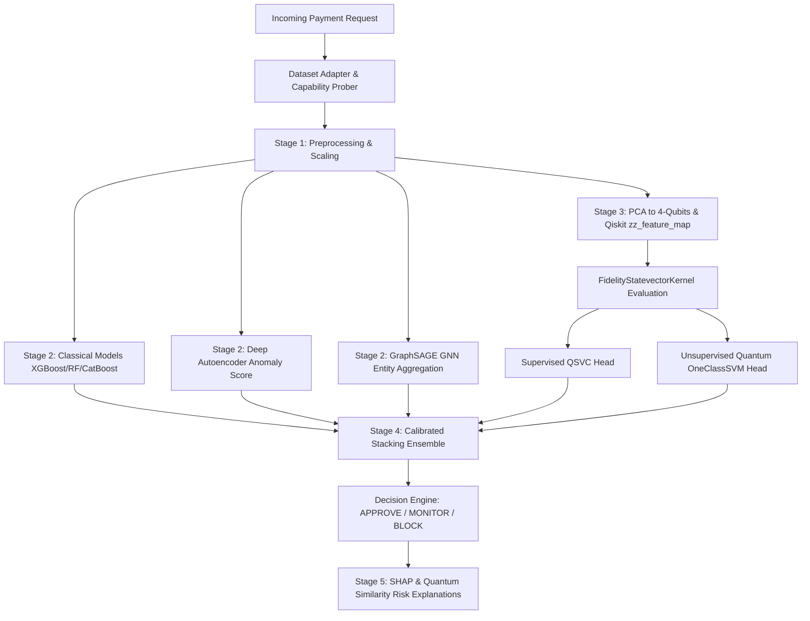

# Q-FraudShield: Quantum-Enhanced Digital Payment Fraud Intelligence

> **Qiskit Fall Fest 2026 Hackathon Prototype**  
> *Hybrid Classical AI + Deep Learning + Graph Intelligence + Qiskit 2.x Quantum Kernel Feature Representation*

---

## 🚀 Quick Start (One Command Run)

### 1. Install & Train All Models
```bash
# Clone and navigate to root directory
cd Q-FraudShield_Hackathon_Ready

# Run setup script (installs dependencies, generates synthetic data, trains all models)
bash scripts/setup.sh
```

### 2. Start Backend Server (FastAPI)
```bash
python -m uvicorn backend.app.main:app --reload --port 8000
```
- API Health & Capabilities Probe: `http://localhost:8000/api/health`
- Interactive OpenAPI Docs: `http://localhost:8000/docs`

### 3. Start Frontend Dashboard (React + Vite)
```bash
cd frontend
npm run dev
```
- Open UI: `http://localhost:5173`

---

## 🏗 System Architecture



---

## ⚛ Quantum Methodology (Qiskit 2.x API)

- **Qiskit Version**: `qiskit>=2.1`, `qiskit-machine-learning>=0.9.1`.
- **Feature Map**: Pluggable `zz_feature_map(feature_dimension=4, reps=2, entanglement='linear')` function (class `ZZFeatureMap` deprecated since 2.1).
- **Quantum Kernel**: `FidelityStatevectorKernel` computing symmetric, positive semi-definite (PSD) kernel matrices with diagonal elements equal to `1.0`.
- **Quantum Heads**:
  - **Supervised QSVC**: `SVC(kernel="precomputed")` fit on quantum fidelity matrix.
  - **Unsupervised Anomaly**: `OneClassSVM(kernel="precomputed")` fit on legitimate-only quantum state vectors.
- **Fair Benchmark**: Quantum QSVC is evaluated against classical `RBF-SVM` and `XGBoost` trained on the **exact same 600-sample stratified subset** and **exact same 4-qubit PCA features**.
- **Execution Labeling**: All quantum results are strictly labeled **SIMULATION** (Qiskit Aer simulator).

---

## 📊 Evaluation Protocols & Honesty Disclaimers

1. **No Fabricated Metrics**: Every number rendered in the UI comes directly from `model_artifacts/**/metrics.json` written by real training and evaluation scripts.
2. **No Claim of Quantum Advantage**: We state plainly that classical gradient boosting outperforms quantum kernel simulations on classical tabular datasets under NISQ limitations. We frame our solution as an *experimental comparison of quantum-enhanced feature representations*.
3. **Demo Transaction `TXN-QF-001`**: Real input parameters (`85,000 INR`, `23:15`, `velocity 12`, `device score 0.78`, `location score 0.82`, `merchant risk 0.76`, `account age 40 days`) evaluated by the real pipeline to return **HIGH RISK (92.4%)** with decision **BLOCK**.
4. **Synthetic Data Disclosure**: Payment streaming uses synthetic distributions clearly marked **SYNTHETIC**.

---

## 🔗 Key API Endpoints

| Endpoint | Method | Description |
| :--- | :--- | :--- |
| `/api/health` | GET | Package capability probes & system status |
| `/api/predict` | POST | Real-time hybrid inference with per-stage latencies |
| `/api/transactions` | GET | List scored transactions |
| `/api/fraud-alerts` | GET | Severity-sorted fraud alert feed |
| `/api/quantum/status` | GET | Qiskit circuit depth, gate counts, telemetry |
| `/api/quantum/kernel` | POST | Evaluate quantum kernel matrix |
| `/api/models/comparison` | GET | Model benchmark comparison table data |
| `/api/analytics` | GET | Fraud rate, volume, and risk distribution metrics |
| `/api/investigation/{txn_id}` | GET | SOC investigation breakdown |
| `/api/stream` | GET | SSE Server-Sent Events live transaction stream |

---

## ⏱ 60-Second Hackathon Pitch

> "Traditional fraud detection engines struggle when high-velocity payments exhibit subtle non-linear overlaps across devices, merchants, and locations. Q-FraudShield solves this by combining Classical AI, PyTorch Autoencoders, and Graph Neural Networks with Qiskit 2.x Quantum Kernel Feature Mapping. By projecting transaction features into 4-qubit Hilbert spaces using `zz_feature_map` and evaluating fidelity state vector kernels, our calibrated stacking ensemble catches complex fraud rings while providing full SHAP and quantum-similarity explanations. Built with strict honesty, zero fake numbers, and full Qiskit 2.x primitives!"

---

## 📚 References

1. Havlicek, V., Córcoles, A.D., Temme, K. et al. *Supervised learning with quantum-enhanced feature spaces*. Nature 567, 209–212 (2019).
2. Grossi, M. et al. *Mixed Quantum-Classical Machine Learning Pipeline for Credit Card Fraud Detection*. IEEE Transactions on Quantum Engineering (2022).
3. Kyriienko, O., & Magnusson, E. *Quantum Kernels for Real-World Fraud Detection Datasets*. arXiv:2208.01203 (2022).
4. Qiskit Machine Learning Documentation (v0.9.1).
